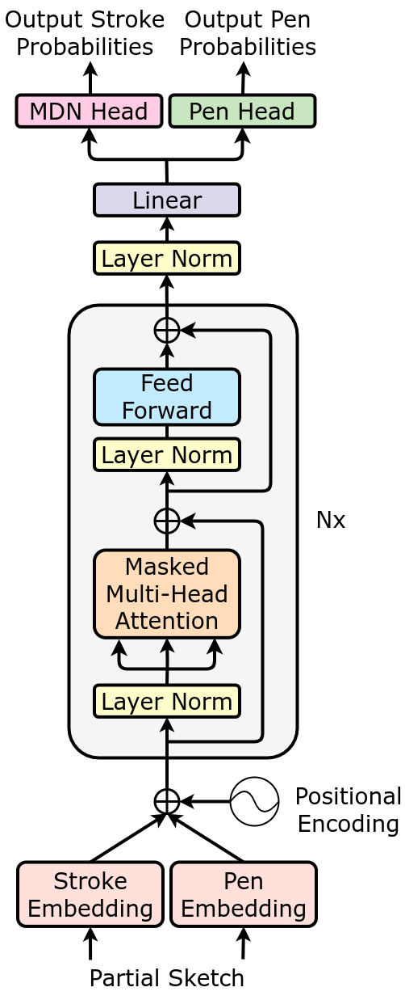
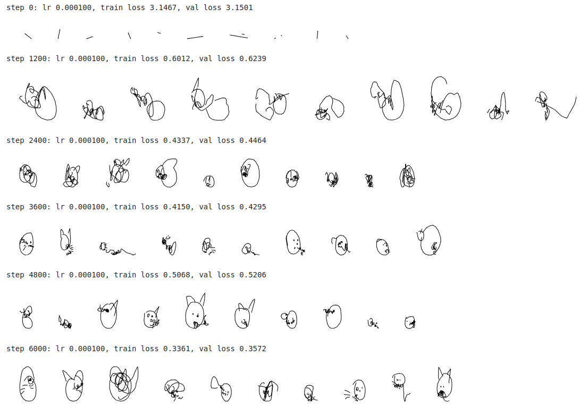
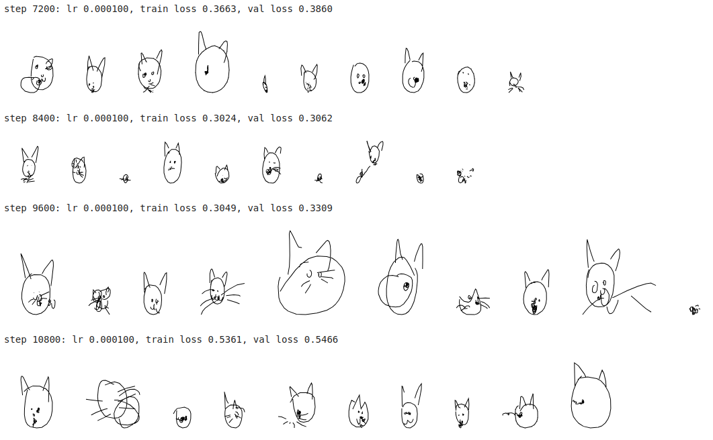
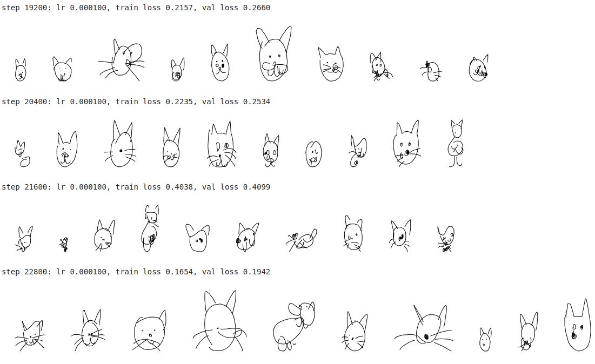

# Learning to generate human-like sketches with a (decoder-only) transformer network

    

This repository is basically the combination of:

- The **:rocket:Transformer model:rocket:** architecture and more specifically Andrej
  Karphathy's [nanoGPT architecture](https://www.youtube.com/watch?v=kCc8FmEb1nY)
  which happens to be the decoder-only version of the original Transformer model in
  the ["Attention is all you Need"](https://arxiv.org/pdf/1706.03762.pdf) paper,
  and which also happens to the architecture of OpenAI's GPT-2 / GPT-3 models
- A cool **drawing application :smiley_cat::scream_cat::smirk_cat:** that I've dug up
  from a very nice paper proposed by David Ha's and Douglas Eck's
  called [sketchRNN](https://arxiv.org/pdf/1704.03477.pdf),
  where they propose to train (recurrent) neural networks to learn to generate human-like doodles as a *sequence of
  strokes*,
  in a manner similar to how children learn to depict objects (and even abstract concepts) with only a few pen strokes

**Disclaimer:** This repository is just me playing with transformers around a fun project that I can combine with our
CNC-drawing machine  :pencil2:
Nothing groundbreaking here as both Transformers and SketchRNN are from 2017, and yes, that is old times already for the
ML world.  
In fact I'm quite late to the party as a 2020 [SketchFormer](https://arxiv.org/pdf/2002.10381.pdf) paper by Ribeiro et
al's already did something very similar,
although with a slightly different architecture: I used a decoder-only architecture as well as a mixture density
network (MDN) output layer whereas they used an encoder-decoder architecture as well as discretized (or continuous but
deterministic) tokens.
More below :point_down:

## How to run the code?

This repo contains a colab notebook `transformer_sketch_generation.ipynb`that you can download
or run directly in your browser
at [:point-right: this link](https://colab.research.google.com/drive/1hq1fwU7W_qS_KSfHmbSFK48oyA3Vv1FW?usp=sharing).

When training the model with proposed hyperparameters on a V100 GPU, the code takes approximately 20 mins to run.
If you do not have a GPU I recommend playing with a smaller model by decreasing `embd` or `num_head`, and `n_layers`
for instance.

## What is going on?

### Dataset

$p \in (0=draw,1=lift,2=eos)$

### Model

The model architecture we use is depicted on the right image.

#### Decoder Backbone

As you can see, the backbone is very similar to the decoder architecture of the Transformer model in
the ["Attention is all you Need"](https://arxiv.org/pdf/1706.03762.pdf).

They are some minor differences within the decoder blocks which follow
the [nanoGPT tutorial](https://www.youtube.com/watch?v=kCc8FmEb1nY):

* layer norm comes *before* the multi-head attention (MHA) and feedforward (FF) layers
* As there is no encoder, we remove the cross-attention layers

:point_right: Be sure to check the nanoGPT tutorial for an in-depth understanding of this architecture and in particular
of the self-attention mechanism which we do not detail here.

#### Input and Output Layers

Now for our target application I had to modify the **input** and **output** layers, as we're dealing with sequences of
*continuous* strokes which is quite different
from traditional text sequences.

Let's start with the input layer.
The input data (partial sketch) is a sequence of stroke-3 tuples $(dx, dy, p)$ where $(dx, dy) \in \mathbb{R}^2$ and $p
\in \\{0,1,2\\}$.

* The pen action $p$ is discrete and can take only 3-values, so the `Pen Embedding` layer is a simple table of 3
  d-dimensional embeddings which we code
  with [nn.Embedding](https://pytorch.org/docs/stable/generated/torch.nn.Embedding.html) layer.
* The stroke action $(dx, dy)$, however, can take continuous values. Therefore, for the `Stroke Embedding` layer we use
  projector mapping the 2D-strokes into a d-dimensional space.
* The positional embedding is, as traditionally,
  a [nn.Embedding](https://pytorch.org/docs/stable/generated/torch.nn.Embedding.html) table of size `block_size` (max
  content length).

For the output layer, we divide it in two heads:

* The `Pen Head` which is simply a Linear Layer which outputs logits of size 3 that we use as parameters of a
  *Categorical Distribution* to sample pen actions at each time step
* The `MDN Head` is a bit more complex, and we detail it below

#### Mixture Density Network (MDN)

[Mixture Density Networks](https://publications.aston.ac.uk/id/eprint/373/1/NCRG_94_004.pdf), originally proposed by
Christopher Bishop in 1994,
uses the output of a neural network as *parameters of a probability distribution* instead of direct output values.

For instance, as shown above, those parameters could be parameters $\\{ \alpha_j, \mu_j, \sigma_j \\}$ of a Gaussian
Mixture Model (GMM) that we use to sample our outputs from $x \sim GMM (\\{ \pi_j, \mu_j, \sigma_j \\})$. 
Imagine that, for each input, the output follows a probabilistic distribution.
If we train our network with a vanilla regression task it will simple learn to recover one output value per input,
which will likely be the average output value for each input. By modelling the output values with a GMM (or other distribution),
we are more likely to be able to recover the true data distribution.

:point-right: David Ha has made a complete [tutorial](https://github.com/hardmaru/pytorch_notebooks/blob/master/mixture_density_networks.ipynb) 
on MDN that I highly recommend to intuitively understand why this is useful for many modern ML tasks in order to enable neural network to generate *multiple* output values for a given
input. 

If you think about it Transformer are already able to generate multiple output tokens given an input token, and they do it
by modelling the outputs as categorical distribution. Here we use MDN to extend this idea to *continuous* tokens, by
modelling the outputs with multivariate normal distributions.

:point-right: You can also have a look at
this [google colab](https://drive.google.com/file/d/1de5Q8ugdKoytOn14FrsVplLuFkMf4Y65/view?usp=sharing) where I play
with MDN for a simple task inspired from David Ha's tutorial,
but where the output is 2-dimensional, where GMM can have *full* covariance matrices as done
in [this repo](https://github.com/haimengzhao/full-cov-mdn/tree/main?tab=readme-ov-file),
and where we use `MultivariateNormal` and `OneHotCategorical` torch distributions to implement the GMM,
as well as `torch.logsumexp` to compute the loss for numerical stability.

### Loss

### Training

Below I show the training loss as well as samples generated by the model after every 1200 training steps, where one
training step is one batch of 64 sketches.

We can see that before training (step 0), the sketches are very short because the pen action $p \in \\{0,1,2\\}$ is
sampled randomly hence $p=2$ (end of sketch) is sampled too early.

Shortly, the model learns to draw longer sequences with already curvy shapes reminiscent of face contours.
It then seems to learn semblance of eyes, ears, and weird moustaches, although not very coherent yet.  

After 6000 steps, it becomes more and more evident that the model has learned to capture the essential components of a
cat sketch:
a round face, two ears, two eyes, a nose and some slightly better (yet still weird) moustaches. Obviously the model is
far from perfect and there are still several failed scribbles and quite funny abstractions of cats...

I've finally let the model train for a total of 24000 steps, and maybe more would have been useful as the the
training/validation loss that kept going down, although the loss I'm plotting here is quite noisy as only estimated on
10 batches.

That's finally the kind of sketches we obtain at the end of training!
Despite all being quite silly, I'm quite happy with the results and confident that more can be done to improve these
doodles even further.

### Evaluation

The loss $L_R$ over the whole test set is $\approx 0.21$.

## Playing with the  model

### Generating sketches

The trained model is saved under `model_cat.pth` and the `generate_samples.py` script enables to
load this model and generate sketches as SVG images without having to re-run the whole notebook.
This is the kind of sketches we obtain:

### Interacting with human sketches

### CNC-Drawing the results

## Next Steps

Things that I'd like to try next:

* Finetune model and hyper-parameters: learning rate decay, gradient clipping, etc
* Multi-class training on the Quick Draw Dataset
* Multi-class training on [TU-Berlin Sketch Dataset](https://cybertron.cg.tu-berlin.de/eitz/projects/classifysketch/)
  which seems to have slightly more advanced sketches and where strokes are represented by sequences of 7-tuple strokes
* Class-conditioned Sketch Generation, with a encoder and conditional VAE akin to what is done
  in [this paper](https://arxiv.org/pdf/2205.09391.pdf)
* I'd looove to generate more artisty sketches in the style of
  these [one line art drawings](https://medium.com/@michellegemmeke/the-art-of-one-line-drawings-8cd8fd5a5af7),
  as I found them very poetic and minimalist at the same time, and could make great tattoo designs! So if you know any
  open database of such drawings please let me know :pray:

## License

This repository is licensed under the [MIT License](https://github.com/mayalenE/sketch-transformer/blob/main/LICENSE).
