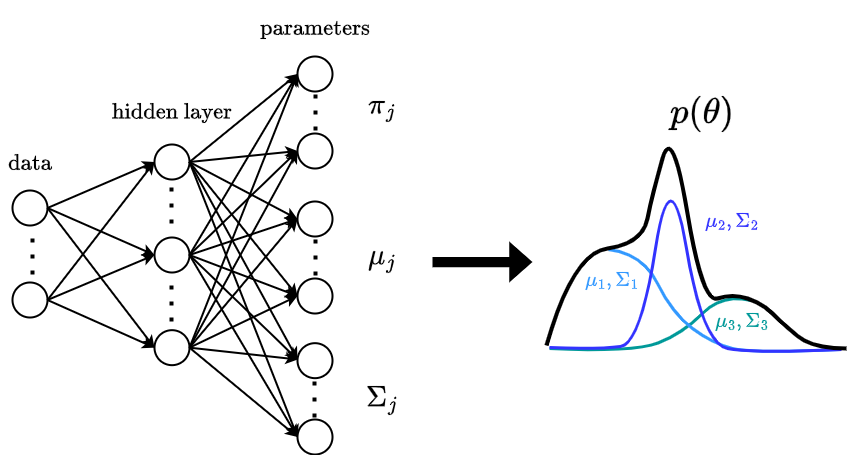
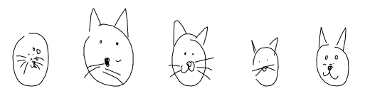

# Learning to generate human-like sketches with a (decoder-only) transformer network

    

This repository provides a tutorial on how to combine:

- The **:rocket:Transformer model:rocket:** and more specifically Andrej
  Karphathy's [nanoGPT architecture](https://www.youtube.com/watch?v=kCc8FmEb1nY)
  which is the decoder-only version of the Transformer model from
  the original ["Attention is all you Need"](https://arxiv.org/pdf/1706.03762.pdf) paper (as well as OpenAI's GPT-2/3 models architecture)
- A **:smiley_cat: drawing application :smiley_cat:** that I've dug up
  from a very nice paper proposed by David Ha and Douglas Eck
  called [sketchRNN](https://arxiv.org/pdf/1704.03477.pdf),
  where they propose to train (recurrent) neural networks to learn to generate human-like doodles as a *sequence of
  strokes*,
  in a manner similar to how children learn to depict objects (and even abstract concepts) with only a few pen strokes

**Disclaimer:** This repository is just me playing with transformers around a fun project that I can combine with our
CNC-drawing machine  :pencil2:
Nothing groundbreaking here as both Transformers and SketchRNN are from 2017, old times in the fast-paced world of machine learning!  
In fact I'm quite late to the party as a 2020 paper by Ribeiro et
al. called ["SketchFormer"](https://arxiv.org/pdf/2002.10381.pdf) already did something very similar,
although with a slightly different architecture/pipeline as they used an encoder-decoder architecture as well as discretized tokens (or continuous but
deterministic tokens) whereas I used a decoder-only architecture as well as a mixture density network (MDN) output layer.
More below 👇

## How to run the code?

This repo contains a colab notebook `transformer_sketch_generation.ipynb`that you can download
or [👉 run directly in your browser](https://colab.research.google.com/drive/1hq1fwU7W_qS_KSfHmbSFK48oyA3Vv1FW?usp=sharing).

When training the model with proposed hyperparameters on a V100 GPU, the code takes approximately 20 mins to run.
If you do not have a GPU, I recommend playing with a smaller model by decreasing `embd` or `num_head`, and `n_layers`
for instance.

## What is going on?

### Dataset

The code uses the [Quick, Draw! Dataset](https://github.com/googlecreativelab/quickdraw-dataset) as training data. 
The model is currently trained on the `cat` class of this dataset, but other set of classes can easily be tested by changing the 
`data_classes` hyperparameter in the notebook.

For each class, the dataset contains a set of 70K sketches for training, 2.5K for validation and 2.5K for testing.
A sketch is represented as a sequence of pen stroke actions where each action $a$ is a vector of 3 elements $a=(\Delta x, \Delta y, p)$.
The $(\Delta x, \Delta y)$ values are continuous and represent the offset from the current pen position to the previous one, and are normalized in the notebook
to have a standard deviations of 1.
The $p$ value is discrete: $0$ for drawing, $1$ for lifting the pen and $2$ for end of sketch indicating that no subsequent points will be rendered.

### Sketch-Transformer Model

The model architecture is summarized on the right image and below.

#### Decoder Backbone

As you can see, the backbone is very similar to the decoder architecture of the famous Transformer model from the
the ["Attention is all you Need"](https://arxiv.org/pdf/1706.03762.pdf) paper.

There are however some minor differences within the decoder blocks which follow
the nanoGPT tutorial:

* Layer normalization comes *before* the multi-head attention (MHA) and feedforward (FF) layers
* As there is no encoder, cross-attention layers are removed

👉 For more details on the self-attention mechanism and for an in-depth understanding of this architecture be sure to check the [nanoGPT tutorial](https://www.youtube.com/watch?v=kCc8FmEb1nY) 
which I highly recommend to anyone interested!

#### Input and Output Layers

The **input** and **output** layers are however quite different than in the original Transformer as we're dealing with sequences of
*continuous* strokes and *discrete* pen actions, and not simply strings.

Let's start with the input layer.
The input data, which is a partial sketch, is a sequence of stroke-3 tuples $(dx, dy, p)$ where $(dx, dy) \in \mathbb{R}^2$ and $p
\in \\{0,1,2\\}$.

* The pen action $p$ is discrete and can take only 3-values, so the `Pen Embedding` layer is a simple table of 3
  d-dimensional embeddings which we implement
  with the [nn.Embedding](https://pytorch.org/docs/stable/generated/torch.nn.Embedding.html) layer.
* The stroke action $(dx, dy)$, however, can take continuous values. Therefore, for the `Stroke Embedding` layer, we use
  a projector mapping the 2D-strokes into a d-dimensional space.
* The positional embedding is, as traditionally,
  a [nn.Embedding](https://pytorch.org/docs/stable/generated/torch.nn.Embedding.html) table of size `block_size` (max
  content length) which describes the position of a stroke in the sequence.

For the output layer, we divide it in two heads:

* The `MDN Head` which stands for *Mixture Density Network* and that we detail below.
* The `Pen Head` which is simply a Linear Layer which outputs logits of size 3. The output logits are used as parameters of a
  *Categorical Distribution* to sample pen actions at each time step, akin to what is done for string sequence generation.

#### Mixture Density Network (MDN)

[Mixture Density Networks](https://publications.aston.ac.uk/id/eprint/373/1/NCRG_94_004.pdf), originally proposed by
Christopher Bishop in 1994,
uses the output of a neural network as *parameters of a probability distribution* instead of direct output values.

    

In our case, as shown above, the network outputs are parameters $\\{ \pi_j, \mu_j, \Sigma_j \\}_{j=1..M}$ of a [Multivariate Gaussian
Mixture Model (GMM)](https://en.wikipedia.org/wiki/Mixture_model#Multivariate_Gaussian_mixture_model) with $M=20$ components
that we use to sample stroke actions from: 

$$ \begin{align*}
a &\sim f(\theta) \\
f(\theta) &= \sum^{M}_{j=1} \pi_j \: \mathcal{N} (\mu_j, \Sigma_j)
\end{align*} $$

The intuition here is that if we would directly train our network to predict strokes with a vanilla regression task, e.g. with MLE loss,
it would only learn to recover the average output stroke per input sequence. The average in that case can often be not correct: when drawing a cat face for instance, after drawing the ears 
some might move to the eyes whereas others might draw the face contour and learning the average of these strokes options will result in something pretty bad looking.
By modelling the output values with a GMM (or other distribution) instead, the network can learn to generate *multiple* output values for a given
input hence is more likely to recover the true data distribution.

If you think about it, Transformers already do a similar thing with discrete sequences: they probabilistically generate an output token given an input token sequence
by modelling the outputs with a categorical distribution. MDN is a way to extend this idea to *continuous* tokens.

👉 David Ha has made a complete [tutorial](https://github.com/hardmaru/pytorch_notebooks/blob/master/mixture_density_networks.ipynb) 
on MDN that I highly recommend to intuitively understand why this can be useful for many modern ML tasks.
You can also have a look at
this [google colab](https://drive.google.com/file/d/1de5Q8ugdKoytOn14FrsVplLuFkMf4Y65/view?usp=sharing) where I extend David Ha's tutorial to play
with MDN with *full* covariance matrix on a task with *2-dimensional* output, and with a new implementation
where we use `MultivariateNormal` and `OneHotCategorical` torch distributions to implement the GMM,
as well as `torch.logsumexp` to compute the loss for numerical stability, akin to what is done in [this repo](https://github.com/haimengzhao/full-cov-mdn/tree/main?tab=readme-ov-file).

### Loss

Our loss is the same than the *reconstruction loss* $L_R$ of the Sketch-RNN paper, which basically maximilizes
the log-likelihood of the generated probability distributions to explain the training data.
More precisely $L_R$ is the sum of the negative log-likelihood of 1) the predicted GMM distributions
in explaining the $\\{\Delta x_i\\}$ stroke actions ($L_s$) and 2) the predicted categorical 
distributions in explaining the $\\{p_i\\}$ pen actions ($L_p$):

$$ \begin{align*} 
L_R &= L_s + L_p \\
L_s &= - \frac{1}{N_{max}} \sum_{i=1}^{N_s} \log (\sum_{j=1}^{L} \prod_{j,i} \pi_{i,j} \mathcal{N} (\Delta x_i | \mu_{i,j}, \Sigma_{i,j})) \\
L_p &= - \frac{1}{N_{max}} \sum_{i=1}^{N_{max}} \log q_{i}[p_i]
\end{align*} $$

where $(\pi_{i,j}, \mu_{i,j}, \Sigma_{i,j})_{j=1..M}$ are the outputs of the `MDN head` for the i-th entry, and $q_i$ are the outputs of the `Pen head`.

### Training

Below we see the loss as well as example generated samples every 1200 training steps (one step = one batch of 64 sketches).

Before training (step 0), the sketches are very short because the pen action $p=2$ (end of sketch) is sampled uniformely hence too early.

During training, the model shortly learns to draw longer sequences with already curvy shapes reminiscent of face contours (step 1200).
As training progresses it seems to learn semblance of eyes, ears, and weird moustaches, although not very coherent yet (step 6000).  

After 6000 steps, it becomes more and more evident that the model learns to capture the essential components of a
cat sketch:
a round face, two pointy ears, two eyes, a nose and some slightly better (yet still weird) moustaches. 

Obviously the model is
far from perfect and there are still several failed scribbles and funny generalizations of cats...

I've finally let the model train for a total of 24000 steps, and maybe more would have been useful as the the
training/validation loss kept going down, although the loss I'm plotting here is quite noisy (estimated on
10 batches only).

That's finally the kind of sketches we obtain at the end of training!
Despite all being quite silly, I'm quite happy with the results and confident that more can be done to improve these
doodles even further 🐈.

### Evaluation

The loss over the whole test set is $L_R \approx 0.21$.

## Playing with the  model

### Generating sketches

The trained model is saved under `model_cat.pth` and the `generate_samples.py` script enables to
load this model and generate sketches as SVG images without having to re-run the whole notebook.
Below are example sketches we obtain with a temperature $\tau=0.4$:

Note that the random generations can result in weird sketches, like the one on the left here. It can also, but rarely, draw cats with a body although this is often badly done as not often seen in the training data.

### Interacting with human sketches

We can also the have the model interact with a human simply by letting a human draw portions of the sketch, and letting the model complete the sequence.
There are some lines of code in the notebook enabling the human to generate the starting curve (sequence of strokes without lifting the pen) through a drawing interface.
We can then let the model complete the drawing sequence to finish the cat.
Below is an example where the human drew a oval shape (shown in black) and the model proposed 10 possible completions (shown in red), again with $\tau=0.4$.

### CNC-Drawing the results
If you are interested in having a robot drawing the results, as shown in the above gif, 
the simplest way is simply to buy a drawing machine :smiley:
You could for instance have a look at [this one](https://fr.aliexpress.com/item/32917861259.html?src=google&aff_fcid=80bd88f758234ec8b18629c4a60cd6b0-1709885232322-05425-UneMJZVf&aff_fsk=UneMJZVf&aff_platform=aaf&sk=UneMJZVf&aff_trace_key=80bd88f758234ec8b18629c4a60cd6b0-1709885232322-05425-UneMJZVf&terminal_id=3ce725d72e464ac09f72cbe7c0d382b9&afSmartRedirect=y) 
or [this one](https://www.amazon.com/iDrawHome-Plotter-iDraw1-0-16T-Handwriting-Assemble/dp/B07FPL6R6F/ref=sr_1_22?crid=1FBGCG8XF1EBT&dib=eyJ2IjoiMSJ9.pmoW0TraqbDInvfYdTDVUwzZhDBAvxIcGIlXnANFVHH0baQwyVu6jgJWBi3QZHIrItdefErYqqSc6UQimoqiv0ZmnPTaKvuyUh2mcEe3gT2SuDCRvwK3uC9CzfMQl12Y72KWA-bfXck-6V8jde3D5IC1pxTMZXJgw23LfXREjg60zG4jXJiC-eWfFJHbyI61P5tinCMCfLPf2lGA6-a2J156YEYf2palskXZwQGlB2R7ff1kbsljv0-yk15LxhpQxZB9AAIvHehG4oLMFrj6t-2ydxS-rbGEI7PeZs8WQZs.VXMuvjd85-DqHY0C_IO3S-5f7XMIyEDi0OZ53v4gxxg&dib_tag=se&keywords=drawing+robot&qid=1709885071&sprefix=drawing+robot%2Caps%2C208&sr=8-22)
with everything set up to hold a pen and start drawing!

In our case, we opted for another option (see [aliexpress link](https://fr.aliexpress.com/item/4000092252232.html?spm=a2g0o.order_list.order_list_main.10.29eb1802JCGWPW&gatewayAdapt=glo2fra))
which requires a bit of fine-tuning as it is not originally intended for this stuff but for laser engraving. It is a CNC machine which you can buy without the laser/engraving frame, and has the advantage of having  much bigger working area. 
However it needs a few steps and a bit of 3d printing to make it work, with all credits going to [Antun Skuric](https://askuric.github.io/) for that :smiley: :
- First you need to add an additional motor to motorise the z-axis, originally the laser engraver did not have it as it does not move in z-axis 
(but the electronics have everything you need for the z-axis - checked it before buying)
- Then you need to 3D-print (or make somehow differently) a pen holder of some kind
- Then you might need to add few wooden slats to ensure proper fixing of the paper (need to be horizontal and to not move during drawing)

Once you have your machine, most of them use G-CODE based protocols and the absolute simplest program that we've found online that does the job of sending the commands to the machine from the PC is the [UniversalGcode sender](https://github.com/winder/Universal-G-Code-Sender) (and its also open source, which is nice).

Great, you should now have everything you need to go and draw those silly cat faces by yourself :joy_cat:

## Next Steps

Things that I'd like to try next:

* Finetune model and hyper-parameters: learning rate decay, gradient clipping, etc
* Multi-class training on the Quick Draw Dataset and on the [TU-Berlin Sketch Dataset](https://cybertron.cg.tu-berlin.de/eitz/projects/classifysketch/)
  which seems to have slightly more advanced sketches, where sketches are represented by sequences of 7-tuple strokes (bezier curves)
* Class-conditioned Sketch Generation, with a encoder and conditional VAE akin to what is done
  in [this paper](https://arxiv.org/pdf/2205.09391.pdf)
* I'd looove to generate more artisty sketches in the style of
  these [one line art drawings](https://medium.com/@michellegemmeke/the-art-of-one-line-drawings-8cd8fd5a5af7),
  as I found them very poetic and minimalist at the same time, and could make great tattoo designs! So if you know any
  open database of such drawings please let me know :pray:

## License

This repository is licensed under the [MIT License](https://github.com/mayalenE/sketch-transformer/blob/main/LICENSE).
