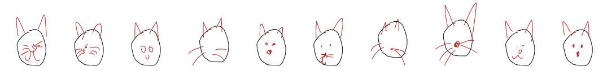

# Learning to generate human-like sketches with a (decoder-only) transformer network

    

This repository is basically the combination of:

- The **:rocket:Transformer model:rocket:** architecture and more specifically Andrej
  Karphathy's [nanoGPT architecture](https://www.youtube.com/watch?v=kCc8FmEb1nY)
  which happens to be the decoder-only version of the original Transformer model in
  the ["Attention is all you Need"](https://arxiv.org/pdf/1706.03762.pdf) paper,
  and which also happens to the architecture of OpenAI's GPT-2 / GPT-3 models
- A cool **drawing application :smiley_cat::scream_cat::smirk_cat:** that I've dug up
  from a very nice paper proposed by David Ha's and Douglas Eck's
  called [sketchRNN](https://arxiv.org/pdf/1704.03477.pdf),
  where they propose to train (recurrent) neural networks to learn to generate human-like doodles as a *sequence of
  strokes*,
  in a manner similar to how children learn to depict objects (and even abstract concepts) with only a few pen strokes

**Disclaimer:** This repository is just me playing with transformers around a fun project that I can combine with our
CNC-drawing machine  :pencil2:
Nothing groundbreaking here as both Transformers and SketchRNN are from 2017, and yes, that is old times already for the
ML world.  
In fact I'm quite late to the party as a 2020 [SketchFormer](https://arxiv.org/pdf/2002.10381.pdf) paper by Ribeiro et
al's already did something very similar,
although with a slightly different architecture: I used a decoder-only architecture as well as a mixture density
network (MDN) output layer whereas they used an encoder-decoder architecture as well as discretized (or continuous but
deterministic) tokens.
More below :point_down:

## How to run the code?

This repo contains a colab notebook `transformer_sketch_generation.ipynb`that you can download
or run directly in your browser
at [:point-right: this link](https://colab.research.google.com/drive/1hq1fwU7W_qS_KSfHmbSFK48oyA3Vv1FW?usp=sharing).

When training the model with proposed hyperparameters on a V100 GPU, the code takes approximately 20 mins to run.
If you do not have a GPU I recommend playing with a smaller model by decreasing `embd` or `num_head`, and `n_layers`
for instance.

## What is going on?

### Dataset

We use the [Quick, Draw! Dataset](https://github.com/googlecreativelab/quickdraw-dataset) as training data. 
The model is currently trained on the `cat` class of this dataset, but other subsets can be tried simply by changing the 
`data_classes` hyperparameter in the notebook.

For each class, the dataset contains a set of 70K sketches for training, 2.5H for validation and 2.5K for testing.
A sketch is represented as a sequence of pen stroke actions where each action is a vector of 3 elements $a=(\Delta x, \Delta y, p)$.
The $(\Delta x, \Delta y)$ are the offset distance from the current pen position to previous one, and are normalized in the notebook
to have a standard deviations of 1.
The $p$ value can take 3 possible states: $0$ for drawing, $1$ for lifting the pen, and $2$ for end of sketch (no subsequent points will be rendered).

### Sketch-Transformer Model

The model architecture we use is depicted on the right image.

#### Decoder Backbone

As you can see, the backbone is very similar to the decoder architecture of the Transformer model in
the ["Attention is all you Need"](https://arxiv.org/pdf/1706.03762.pdf).

They are some minor differences within the decoder blocks which follow
the [nanoGPT tutorial](https://www.youtube.com/watch?v=kCc8FmEb1nY):

* layer norm comes *before* the multi-head attention (MHA) and feedforward (FF) layers
* As there is no encoder, we remove the cross-attention layers

:point_right: Be sure to check the nanoGPT tutorial for an in-depth understanding of this architecture and in particular
of the self-attention mechanism which we do not detail here.

#### Input and Output Layers

Now for our target application I had to modify the **input** and **output** layers, as we're dealing with sequences of
*continuous* strokes which is quite different
from traditional text sequences.

Let's start with the input layer.
The input data (partial sketch) is a sequence of stroke-3 tuples $(dx, dy, p)$ where $(dx, dy) \in \mathbb{R}^2$ and $p
\in \\{0,1,2\\}$.

* The pen action $p$ is discrete and can take only 3-values, so the `Pen Embedding` layer is a simple table of 3
  d-dimensional embeddings which we code
  with [nn.Embedding](https://pytorch.org/docs/stable/generated/torch.nn.Embedding.html) layer.
* The stroke action $(dx, dy)$, however, can take continuous values. Therefore, for the `Stroke Embedding` layer we use
  projector mapping the 2D-strokes into a d-dimensional space.
* The positional embedding is, as traditionally,
  a [nn.Embedding](https://pytorch.org/docs/stable/generated/torch.nn.Embedding.html) table of size `block_size` (max
  content length).

For the output layer, we divide it in two heads:

* The `Pen Head` which is simply a Linear Layer which outputs logits of size 3 that we use as parameters of a
  *Categorical Distribution* to sample pen actions at each time step
* The `MDN Head` is a bit more complex, and we detail it below

#### Mixture Density Network (MDN)

[Mixture Density Networks](https://publications.aston.ac.uk/id/eprint/373/1/NCRG_94_004.pdf), originally proposed by
Christopher Bishop in 1994,
uses the output of a neural network as *parameters of a probability distribution* instead of direct output values.

In our case, as shown above, the network outputs are parameters $\\{ \pi_j, \mu_j, \Sigma_j \\}$ of a [Multivariate Gaussian
Mixture Model (GMM)](https://en.wikipedia.org/wiki/Mixture_model#Multivariate_Gaussian_mixture_model) 
that we use to sample our outputs from: $x \sim p(\theta)$ with $p(\theta) = \sum_{j=1}^{M} \pi_j \mathcal{N} (\mu_j, \Sigma_j)$. 

The intuition is that if we would not train our network to output a probability distribution
but directly the predicted strokes with a vanilla regression task, it would simply learn to recover one output stroke per input sequence (the average if trained with MLE). 
By modelling the output values with a GMM (or other distribution), we enable the network to generate *multiple* output values for a given
input hence we are more likely to be able to recover the true data distribution.

If you think about it for discrete sequences Transformer are already able to generate multiple output tokens given an input token sequence, and they do it
by modelling the outputs with a categorical distribution. Here we use MDN to extend this idea to *continuous* tokens, by
modelling the outputs with multivariate normal distributions.

:point-right: David Ha has made a complete [tutorial](https://github.com/hardmaru/pytorch_notebooks/blob/master/mixture_density_networks.ipynb) 
on MDN that I highly recommend to intuitively understand why this can be useful for many modern ML tasks.

:point-right: You can also have a look at
this [google colab](https://drive.google.com/file/d/1de5Q8ugdKoytOn14FrsVplLuFkMf4Y65/view?usp=sharing) where I extend David Ha's tutorial to play
with MDN with *full* covariance matrix on a task with *2-dimensional* output, and with a new implementation
where we use `MultivariateNormal` and `OneHotCategorical` torch distributions to implement the GMM,
as well as `torch.logsumexp` to compute the loss for numerical stability, akin to what is done in [this repo](https://github.com/haimengzhao/full-cov-mdn/tree/main?tab=readme-ov-file).
### Loss

Our loss is the same than the *reconstruction loss* $L_R$ of the Sketch-RNN paper, which basically maximilizes
the log-likelihood of the generated probability distribution to explain the training data.
More precisely $L_R = L_s + L_p$ is the sum of $L_s$, negative log-likelihood of the generated GMM distributions
to explain the set of $\\{\Delta x_i\\}$ stroke actions, and $L_p$, negative log-likelihood of the generated categorical 
distributions to explain the set of $\\{p_i\\}$ pen actions:

$$ \begin{align*} 
L_s &= - \frac{1}{N_{max}} \sum_{i=1}^{N_s} \log (\sum_{j=1}^{L} \prod_{j,i} \pi_{i,j} \mathcal{N} (\Delta x_i | \mu_{i,j}, \Sigma_{i,j})) \\
L_p &= - \frac{1}{N_{max}} \sum_{i=1}^{N_{max}} \log q_{i}[p_i]
\end{align*} $$

where $(\pi_{i,j}, \mu_{x_i,j}, \Sigma_{x_i,j})_{j=1..M}$ are the outputs of the MDN head for the i-th entry, and $q_i$ are the outputs of the Pen head.

### Training

Below I show the training loss as well as samples generated by the model after every 1200 training steps, where one
training step is one batch of 64 sketches.

We can see that before training (step 0), the sketches are very short because the pen action $p \in \\{0,1,2\\}$ is
sampled randomly hence $p=2$ (end of sketch) is sampled too early.

Shortly, the model learns to draw longer sequences with already curvy shapes reminiscent of face contours.
It then seems to learn semblance of eyes, ears, and weird moustaches, although not very coherent yet.  

After 6000 steps, it becomes more and more evident that the model has learned to capture the essential components of a
cat sketch:
a round face, two ears, two eyes, a nose and some slightly better (yet still weird) moustaches. Obviously the model is
far from perfect and there are still several failed scribbles and quite funny abstractions of cats...

I've finally let the model train for a total of 24000 steps, and maybe more would have been useful as the the
training/validation loss that kept going down, although the loss I'm plotting here is quite noisy as only estimated on
10 batches.

That's finally the kind of sketches we obtain at the end of training!
Despite all being quite silly, I'm quite happy with the results and confident that more can be done to improve these
doodles even further.

### Evaluation

The loss $L_R$ over the whole test set is $\approx 0.21$.

## Playing with the  model

### Generating sketches

The trained model is saved under `model_cat.pth` and the `generate_samples.py` script enables to
load this model and generate sketches as SVG images without having to re-run the whole notebook.
Below are example sketches we obtain:

Sometimes we obtain weird sketches, like the ones on the left and sometimes we obtain cats with a body although this is quite rare and not often well done.

Here the temperature is set to $\tau=0.4$.
### Interacting with human sketches

We can also the have the model interact with a human simply by letting a human draw portions of the sketch, and letting the model complete the sequence.
There is some lines of code in the notebook to make an interface enabling the human to generate the starting curve (sequence of strokes without lifting the pen).
We can then let the model complete the sequence to finishs drawing the cat.
Below is an example where the human draw a the oval shape (shown in black) and the model proposed 10 possible completions (shown in red), again with $\tau=0.4$.

### CNC-Drawing the results
If you are interested in having a robot drawing the results, as shown in the above gif, 
the simplest way is simply to buy a drawing machine :smiley:
You could for instance have a look at [this one](https://fr.aliexpress.com/item/32917861259.html?src=google&aff_fcid=80bd88f758234ec8b18629c4a60cd6b0-1709885232322-05425-UneMJZVf&aff_fsk=UneMJZVf&aff_platform=aaf&sk=UneMJZVf&aff_trace_key=80bd88f758234ec8b18629c4a60cd6b0-1709885232322-05425-UneMJZVf&terminal_id=3ce725d72e464ac09f72cbe7c0d382b9&afSmartRedirect=y) 
or [this one](https://www.amazon.com/iDrawHome-Plotter-iDraw1-0-16T-Handwriting-Assemble/dp/B07FPL6R6F/ref=sr_1_22?crid=1FBGCG8XF1EBT&dib=eyJ2IjoiMSJ9.pmoW0TraqbDInvfYdTDVUwzZhDBAvxIcGIlXnANFVHH0baQwyVu6jgJWBi3QZHIrItdefErYqqSc6UQimoqiv0ZmnPTaKvuyUh2mcEe3gT2SuDCRvwK3uC9CzfMQl12Y72KWA-bfXck-6V8jde3D5IC1pxTMZXJgw23LfXREjg60zG4jXJiC-eWfFJHbyI61P5tinCMCfLPf2lGA6-a2J156YEYf2palskXZwQGlB2R7ff1kbsljv0-yk15LxhpQxZB9AAIvHehG4oLMFrj6t-2ydxS-rbGEI7PeZs8WQZs.VXMuvjd85-DqHY0C_IO3S-5f7XMIyEDi0OZ53v4gxxg&dib_tag=se&keywords=drawing+robot&qid=1709885071&sprefix=drawing+robot%2Caps%2C208&sr=8-22)
with everything set up to hold a pen and start drawing!

In our case, we opted for another option (see [aliexpress link](https://fr.aliexpress.com/item/4000092252232.html?spm=a2g0o.order_list.order_list_main.10.29eb1802JCGWPW&gatewayAdapt=glo2fra))
which requires a bit of fine-tuning as it is not originally intended for this stuff but for engraving, but has the advantage of having  much bigger working area. 
It is a CNC machine with a laser/engraving frame (which you can buy *without* the laser and board as we did) and it needs a few steps and a bit of 3d printing to make it work,
with all credits going to [Antun Skuric](https://askuric.github.io/) for that :smiley: :
- First you need to add an additional motor to motorise the z-axis, originally the laser engraver did not have it as it does not move in z-axis 
(but the electronics have everything you need for the z-axis - we've checked it before buying)
- Then you need to 3D-print (or make somehow differently) a pen holder of some kind, which can be quite artisanal as long as it makes the job!
- We also added few wooden slats to facilitate positioning of the paper (which need to be horizontal and not move during printing)

Once you have your machine, most of them use G-CODE based protocols and the absolute simplest program that Antun found online that does the job of sending the commands to the machine from the PC is the [UniversalGcode sender](https://github.com/winder/Universal-G-Code-Sender) (and its also open source, which is nice).

You now have everything you need to go and draw those silly cat faces by yourself :joy_cat:

## Next Steps

Things that I'd like to try next:

* Finetune model and hyper-parameters: learning rate decay, gradient clipping, etc
* Multi-class training on the Quick Draw Dataset and on the [TU-Berlin Sketch Dataset](https://cybertron.cg.tu-berlin.de/eitz/projects/classifysketch/)
  which seems to have slightly more advanced sketches, where sketches are represented by sequences of 7-tuple strokes (bezier curves)
* Class-conditioned Sketch Generation, with a encoder and conditional VAE akin to what is done
  in [this paper](https://arxiv.org/pdf/2205.09391.pdf)
* I'd looove to generate more artisty sketches in the style of
  these [one line art drawings](https://medium.com/@michellegemmeke/the-art-of-one-line-drawings-8cd8fd5a5af7),
  as I found them very poetic and minimalist at the same time, and could make great tattoo designs! So if you know any
  open database of such drawings please let me know :pray:

## License

This repository is licensed under the [MIT License](https://github.com/mayalenE/sketch-transformer/blob/main/LICENSE).
